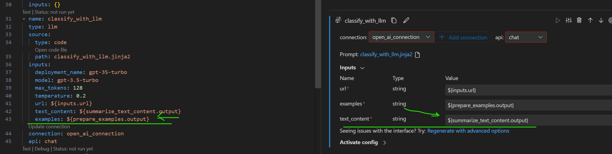
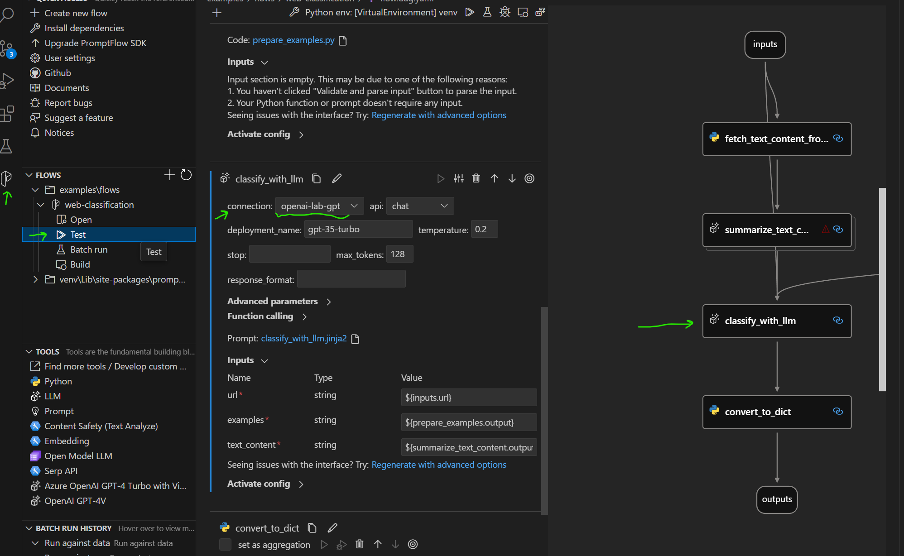
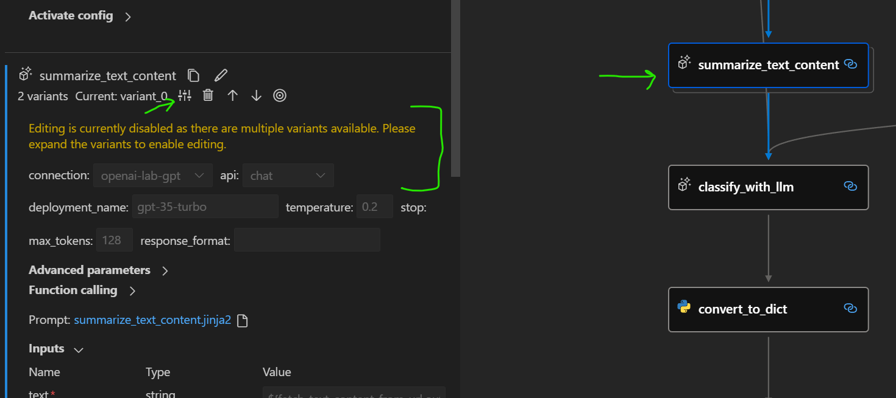
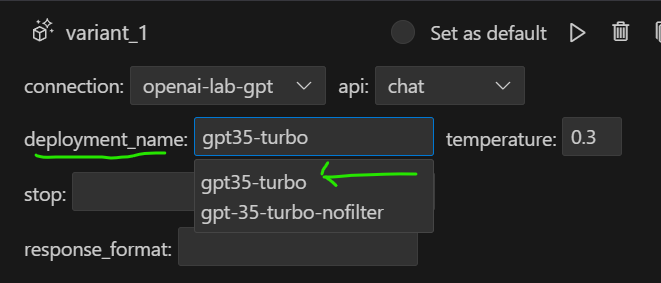

# Azure Prompt Flow Lab
Experimenting with Azure Prompt Flow

In this project we'll start by following this [Azure Prompt Flow guide](https://microsoft.github.io/promptflow/how-to-guides/quick-start.html).  After that we'll look at doing some basic application work with it.

## Setup
I used Python 3.11, but other versions may work.  The above doc suggests 3.9+.

1. Clone this repo
2. Create virtual environment

    ```
    python -m venv venv
    venv\scripts\activate
    ```

3. Install things
    ```
    pip install -r requirements.txt
    ```

4. Verify installation
    ```
    pf -v
    ```
    This should print the version of promptflow, in my case 1.4.1.

# Questions
These are questions I had while working through the materials, and things that puzzled me at first.  As I learn, I'll come back and update this with the answers I found.  You could skip this section, because it's spoilers and won't mean much to you until you dive in, but these things might help you if they seemed puzzling to you at first as you work through the examples.

## Web classification `examples` variable``
> Q: In the web classification example flow, there is a variable in the Jinja template for the LLM that loops through a variable called `examples`.  How is the output of `prepare_examples.py` which comes out as an unnamed list mapped into the variable `examples` in the Jinjia template? Examining the yaml, json, and .py I was unable to determine how this mapping happens.  Is it just because there's only a single input for the jinja template called `examples`, so that must just automatically map to the single input in the jinja template?

* When I view the `classify_with_llm.jinja2` node in the Prompt Flow extension, I see a list of 3 inputs to this node, one of which is `examples*`.  In there I can see the value of this is `${prepare_examples.output}`.  This is where the mapping is happening.  The word `.output` must have special meaning for when the outputs are not named and are just the output.  Looking back at the flow.dag.yaml, I can see the same answer staring back at me, but somehow I didn't see it when it was just .yaml instead of a UI.  It's funny how user interfaces can work to make things more intuitive to the uninitiated.


## How to see the graph using the Prompt Flow Extension
> Q: I've got the Prompt Flow vs code extension installed, and I've got a flow directory with yaml and everything ready to go.  How do I invoke the Prompt Flow extension and see the pretty DAG graph?
* I haven't yet seen instructions in the docs on how to do this, but this is what I have figured out so far:
* You can right click on any directory, and create a new flow here-- there is an additional context menu added.  But that is not really the answer to the question above.
* You can press F1 and search for "flow" and select the command "Prompt Flow: Focus on Flows View".  This will open up a number of windows on the left side, including one called "Flows".  From there you can select examples\flows\web-classification, and click "Open".  Violá, you see a DAG.

## How do I connect Prompt Flow to my Azure OpenAI instance?
> Q: I've got the Prompt Flow extension running now. How do I set it up to talk to my Azure OpenAI instance?
Once you have the extension running as above using F1 and then "Prompt Flow: Focus on Flows View" you will have a new icon on the left side of VS Code, a stylize "P" that is the Prompt Flow icon.  In there, you can click on that, and use the "Connections" window.  I discovered later this is discussed in the [docs: Manage Connections](https://microsoft.github.io/promptflow/how-to-guides/manage-connections.html).

Steps I did:
1. In the [P] prompt flow extension area, under "Connections", under "Azure OpenAI" click +.
    * This opens a new (temporary) yaml file, where I can enter the information needed.
2. Go to the Azure Portal and get my Open AI connection information.
    * In the portal, go to "Keys and Endpoint".
    * Note that you will **not** enter the API key in this file.  That'll happen in a later step.
    * Update the name of the connection.  I named mine the same as the name of my Azure OpenAI instance.
    * Update the endpoint URL.
    * Save the file.
    * When you save the file, it will automatically open the terminal and execute a command line.  This command line will prompt you for the API key.  You'll copy it from the Azure portal, and paste it into this command line app, which apparently squirrels away that api key in a secure way.
3. After doing the above steps I can now see an entry under Connections/Azure OpenAI in the Prompt Flow window.

# Basics
In this section we'll begin working through the quick start and making notes along the way.

* A flow is a series of functions and subfunctions (a [DAG](https://en.wikipedia.org/wiki/Directed_acyclic_graph))
* The flow is represented in a YAML file
* Each node may be connected to others and input/output dependencies
* The *prompt flow executor* [executes the flow](https://microsoft.github.io/promptflow/concepts/concept-flows.html).


There's a sample repo at https://github.com/microsoft/promptflow.git.  I'm going to bring in one example from there here, to `examples/flows/web-classification`.

In this example we'll make a flow which categorizes URLs from the web into one of several predefined classes.

## Anatomy of a Flow
A *flow directory* contains all the contents of a flow.  Let's look at one in `examples/flows/web-classification`.  The contents are:

* `flow.dag.yaml`. This is all the nodes in the flow with their inputs and outputs, tools, and other info.
Looking in here we can see several node types. Some reference Python code, others invoke the LLM.
* `.promptflow/flow.tools.json` Defines the tools which we referred to in the yaml.
* Source files `.py`, `.jinja2` Are the source code files for the tools in the flow.
* `requirements.txt` are the packages needed for this flow.

Let's zoom in and look at two nodes in `flow.dag.yaml`:
```yaml
- name: classify_with_llm
  type: llm
  source:
    type: code
    path: classify_with_llm.jinja2
  inputs:
    deployment_name: gpt-35-turbo
    model: gpt-3.5-turbo
    max_tokens: 128
    temperature: 0.2
    url: ${inputs.url}
    text_content: ${summarize_text_content.output}
    examples: ${prepare_examples.output}
  connection: open_ai_connection
  api: chat
- name: convert_to_dict
  type: python
  source:
    type: code
    path: convert_to_dict.py
  inputs:
    input_str: ${classify_with_llm.output}
```

It looks like the first node, `classify_with_llm` invokes the LLM using a jinja2 template.  Let's take a peek at that template, `classify_with_llm.jinja2`:
```jinja
system:
Your task is to classify a given url into one of the following categories:
Movie, App, Academic, Channel, Profile, PDF or None based on the text content information.
The classification will be based on the url, the webpage text content summary, or both.

user:
The selection range of the value of "category" must be within "Movie", "App", "Academic", "Channel", "Profile", "PDF" and "None".
The selection range of the value of "evidence" must be within "Url", "Text content", and "Both".
Here are a few examples:

URL: {{ex.url}}
Text content: {{ex.text_content}}
OUTPUT:
{"category": "{{ex.category}}", "evidence": "{{ex.evidence}}"}



For a given URL and text content, classify the url to complete the category and indicate evidence:
URL: {{url}}
Text content: {{text_content}}.
OUTPUT:
```

We can see it's going through a loop on the variable `examples`.  By looking further up in the flow YAML, we can see that the examples come from `prepare_examples.py`:
```python
@tool
def prepare_examples():
    return [
        {
            "url": "https://play.google.com/store/apps/details?id=com.spotify.music",
            "text_content": "Spotify is a free music and podcast streaming app with millions of songs, albums, and "
            "original podcasts. It also offers audiobooks, so users can enjoy thousands of stories. "
            "It has a variety of features such as creating and sharing music playlists, discovering "
            "new music, and listening to popular and exclusive podcasts. It also has a Premium "
            "subscription option which allows users to download and listen offline, and access "
            "ad-free music. It is available on all devices and has a variety of genres and artists "
            "to choose from.",
            "category": "App",
            "evidence": "Both",
        },
        ...
    ]
```
But it's not immediately clear how the output from `prepare_examples()` becomes the variable `examples` later on in the template.  There's nothing in the YAML flow that tells it to name the output from this function as `examples`.

However, we can see the `@tool` marker on this function, and there's something in `.promptflow/flow.tools.json` that seems like it could be the missing link. But looking in there, too, I don't see how the output of `prepare_examples.py` becomes the input names `examples` in `classify_with_llm.jinjia2`. Perhaps this will become more clear later.

Let's prepare to run this flow by installing the requirements in requirements.txt.  I looked at those, and it's the 2 requirements we already installed for promptflow, plus Beautiful Soup 4 (an HTML parser).

Run this:
```
cd examples\flows\web-classification
pip install -r requirements.txt
```

## Install VS Code Extension
There's a VS Code extension that lets you view and edit these flow DAGs in an awesome way. Let's try installing it.
Click Here: [Prompt flow VS Code Extension](https://marketplace.visualstudio.com/items?itemName=prompt-flow.prompt-flow) or search for "Prompt flow" in the extensions marketplace, and install it.

Hopefully this will work normally for you, but I had some difficulties.
The marketplace was failing and giving me errors, so I needed to download it manually and install it.  The file I downloaded was a `.vsix` file, and I followed the instructions here to [manually install from a vsix file](https://code.visualstudio.com/docs/editor/extension-marketplace#_install-from-a-vsix).

In explorer, I right clicked on my Downloads folder, and selected "open a terminal here".  From there I did
```
code --install-extension .\prompt-flow.prompt-flow-1.9.2.vsix
```

After that I was able to see that the extension was installed in VS Code by clicking the Extensions icon.

## Flow Types
There are three flow types in Prompt Flow:
* **Chat Flow.** Used in development of an LLM application.  The Chat Flow is designed for interactive chat with a user.  It has chat_history, chat_input, and chat_output.  There is a simple chat application for deployment purposes.
* **Standard Flow.** Used in development of an LLM application.  A normal flow, but without the chat history and UI. (Is this correct?)  Generally if you need conversation history, use a Chat Flow, otherwise use a Standard Flow.
* **Evaluation Flow.** Creates metrics used for offline evaluation of the quality of responses, for example, "Is this answer fact based?"

## Running a Flow
The [quick start guide](https://microsoft.github.io/promptflow/how-to-guides/quick-start.html) talks about using a "code lens action on top of the yaml editor to trigger flow test".  My screen didn't look like theirs for reasons I have not yet figured out.  First, I had to create an OpenAI connection as described in the Questions section above.  Then, to run the flow, this is what I did:
1. Open the flow in the Prompt Flow extension using F1 as described in the questions section.
2. For each of the nodes that use an LLM, select which connection they will use in the dropdown.  (If you don't do this step it's going to error out, because it starts with a different default connection.)



3. **What's a variant?** I was trying to make sure I had all of the nodes that use the LLM cut over to use my OpenAI connection.  One of the nodes looked like it wanted an OpenAI connection, but it said editing was disabled because there are multiple variants available.
  * Click on the `summarize_text_content` node (see image below)
  * Click the little widget to expand the variants.
  * For each of the variants, select the OpenAI connection to use.



4. Now you can click the Test button under Flows, examples\flows, web-classification

At this point I got an error: `{'code': 'DeploymentNotFound', 'message': 'The API deployment for this resource does not exist....`

5. Fix deployment. To fix that error, I changed this:

This is because the deployment names I had in OpenAI were different from how things were set up for this example.  After fixing these for each of the LLM nodes in the flow, I clicked test again.

I was then able to execute the flow from end to end.  There is an input URL specified at the beginning, which was an app on the Google Play store.  The flow fetches the content of the URL, and summarizes it.  Then it runs a prompt which classifies the URL into one of several categories.

## A quick change to the flow
Now that I had something running, I made a few changes:
1. I changed the input URL to https://mossms.com, a game which I made and is still love.
2. I changed the categorization prompt to allow "Entertainment" as a category.  This involved changing the Jinja template.
3. I ran the flow again, and it successfully categorized Mossms as "Entertainment".  I was able to inspect the outputs at each stage, and saw its brief 100 word description of Mossms, which was pretty acceptable, and certainly adequate to do the classification. It worked great!

## Suggestion: Remove flow detail
I removed `flow.detail.json` and added it to gitignore; this doesn't seem like something that should be saved in git.  It contains the results from your last run.


# Trying a new flow: PBI creator

Let's try creating a new flow that is an interactive chat to create PBI (product backlog items), or "Stories".

